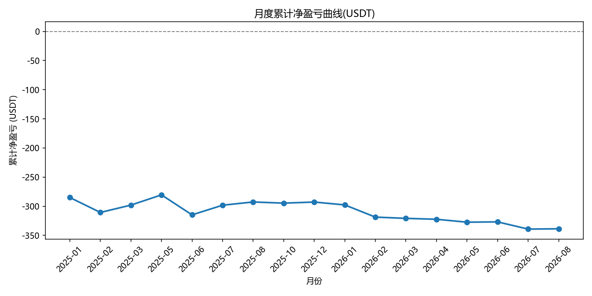
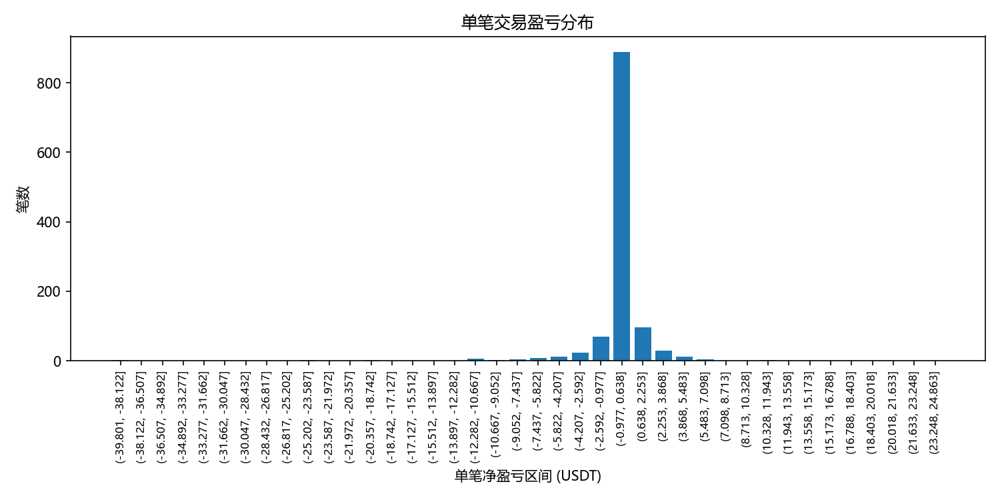
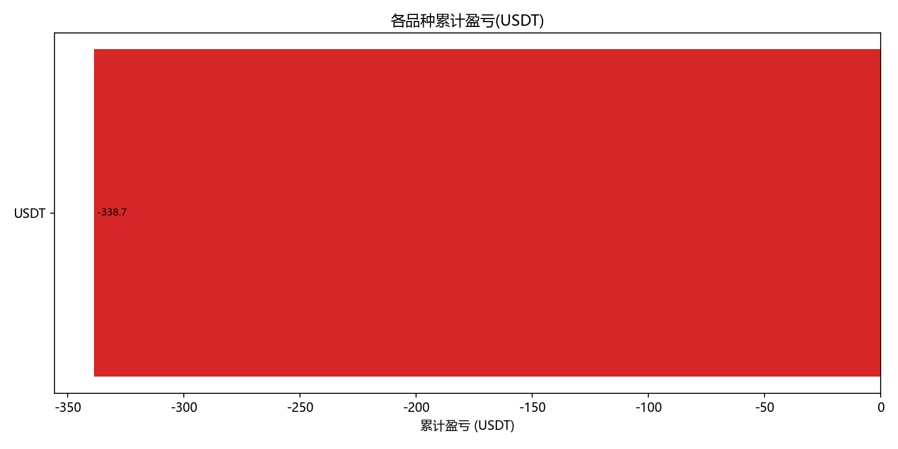
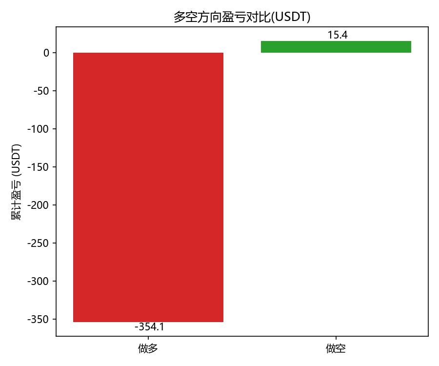

# Trade Performance Analysis

对个人衍生品实盘交易记录(1100+笔平仓)进行绩效归因分析的项目。

## 项目背景

独立实盘交易者,以价格行为(Price Action)体系为核心进行市场结构分析。
本项目用 Python(pandas + matplotlib)对 19 个月的真实交易记录进行系统性统计分析,
以数据发现交易问题并驱动策略迭代。

## 数据来源

- 币安 U 本位合约成交明细导出 CSV(2025-01 ~ 2026-08)
- 2394 条成交记录,1168 笔平仓,覆盖 BTC / ETH / SOL / XAU(黄金)等 10+ 品种

## 核心发现

| 指标 | 数值 |
|------|------|
| 净盈亏(扣费后) | -338.66 USDT |
| 手续费 | 206.69 USDT(占亏损约 60%) |
| 胜率 | 50.4% |
| 盈亏比 | 0.56(平均盈利 +0.75 / 平均亏损 -1.35) |
| 盈亏因子 | 0.57 |
| 做多 vs 做空 | 做多 -354 / 做空 +15 |

### 数据揭示的核心问题

1. **盈亏比失衡是亏损主因**:胜率接近五五开,但盈利单持有不足(赚小亏大),
   平均盈利仅为平均亏损的 56%
2. **交易频率过高**:手续费占亏损约 60%,高频交易成本侵蚀利润
3. **方向性差异**:做空接近打平,做多为主要亏损来源,后续减少逆势做多

## 图表

| 图表 | 说明 |
|------|------|
| `1_monthly_equity.png` | 月度累计净盈亏曲线 |
| `2_pnl_distribution.png` | 单笔盈亏分布 |
| `3_symbol_pnl.png` | 各品种盈亏归因 |
| `4_direction_pnl.png` | 多空方向盈亏对比 |






## 运行方式

```bash
pip install pandas matplotlib
python trade_analysis.py
```

## 技术栈

Python 3.12 / pandas / matplotlib / CSV
